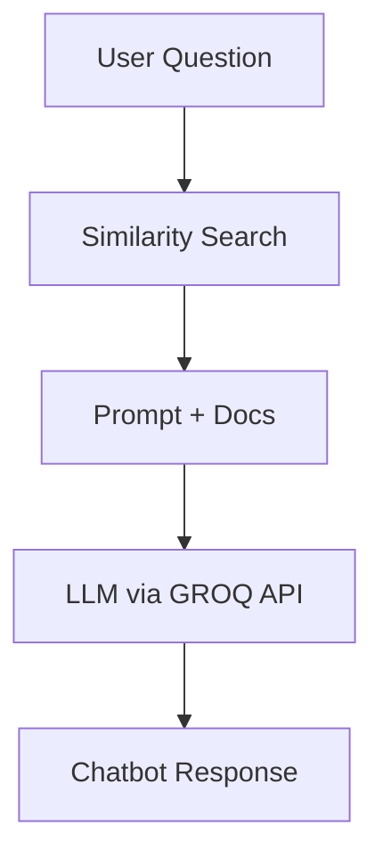

# 🤖 Kubeflow Documentation Assistant (GSoC 2025 PoC)
> 🧪 **Proof of Concept** for [Kubeflow GSoC Project 12 – “Empowering Kubeflow Documentation with LLMs”]  

🔗 **Live Demo:** [kubeflow.kacem-mathlouthi.tn](https://kubeflow.kacem-mathlouthi.tn)

---

## 📌 Project Overview

This is a **full-stack Retrieval-Augmented Generation (RAG)** chatbot designed as a **PoC for GSoC 2024 (Project 12)** with Kubeflow. It combines GitHub-based documentation ingestion, vector search, and LLM-powered responses into an interactive real-time assistant.


---

## 🧠 How It Works



1. 🧑 User submits a question
2. 🔍 Similar documents are retrieved using vector search
3. 🧾 Retrieved chunks are passed as context to an LLM
4. 🤖 Final response is generated and streamed back to the frontend

---

## 🧰 Tech Stack

### 🔙 Backend (FastAPI)
- FastAPI + WebSockets
- Azure OpenAI & GROQ for LLM & embeddings
- Weaviate (local or remote) for vector storage
- LangChain for text chunking & prompt formatting
- Docker & Poetry

### 🌐 Frontend (React)
- React + TypeScript + Vite
- TailwindCSS + ShadCN UI for design
- WebSocket-based real-time chat
- Docker + NGINX for serving
- Markdown rendering with syntax highlighting

---

## 📦 Repo Structure

```
kacemmathlouthi-kubeflow-demo/
├── backend/          # FastAPI, RAG logic, Weaviate, Gitingest integration
├── frontend/         # Chat UI, WebSocket client, Tailwind
├── docker-compose.yml
└── README.md         # ← You're here
```

---

## 🚀 Getting Started

### 🐳 Run with Docker Compose (recommended)

```bash
# From the root directory
docker-compose up --build
```

- Frontend available at: `http://localhost`  
- Backend API at: `http://localhost:8000`

### 💻 Run locally

#### Backend

```bash
cd backend
poetry install
poetry run uvicorn app.main:app --reload
```

#### Frontend

```bash
cd frontend
npm install
npm run dev
```

---

## 🌍 Live Demo

The application is deployed via **NGINX on Azure**, and available here:

👉 **[kubeflow.kacem-mathlouthi.tn](https://kubeflow.kacem-mathlouthi.tn/)**

---

## ✅ Implemented Features

- 🔁 Full RAG pipeline with LLM response generation
- 🔗 GitHub repo ingestion via Gitingest
- 🧠 Embedding + vector search with Weaviate
- 🌐 Real-time WebSocket chat
- ⚙️ Configurable LLM model, temperature, max tokens
- 🧾 Markdown support in replies
- 🚀 Dockerized & deployed to Azure

More info in [`frontend/src/components/implemented-features.tsx`](frontend/src/components/implemented-features.tsx)

---

## 🧪 Planned Features

- 🧠 Multi-turn memory and session tracking
- 📚 Ingest all Kubeflow repos, issues, articles, StackOverflow, etc.
- 🧬 RAG pipeline benchmarking & rerankers
- 🧠 Fine-tuning with Kubeflow Trainer
- ⚙️ Modular pipeline with Kubeflow Pipelines
- 📊 User feedback & prompt engineering

See [`frontend/src/components/upcoming-features.tsx`](frontend/src/components/upcoming-features.tsx)

---
